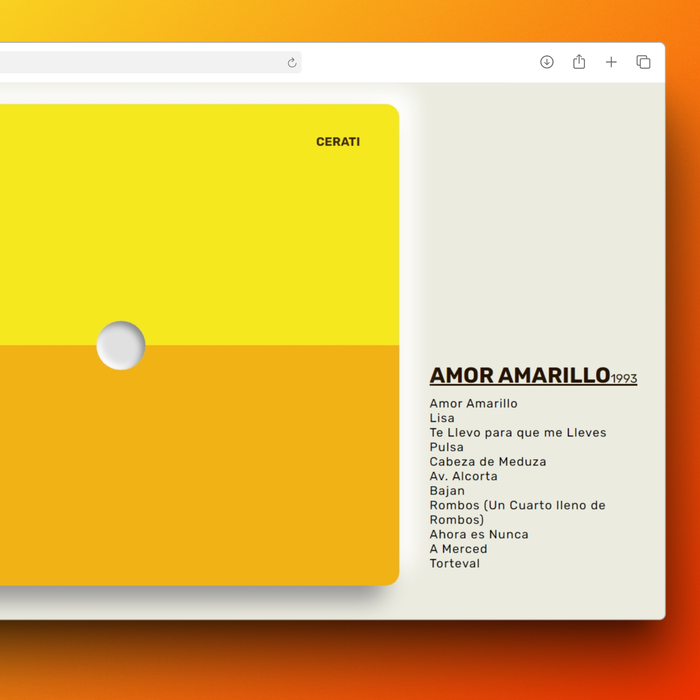
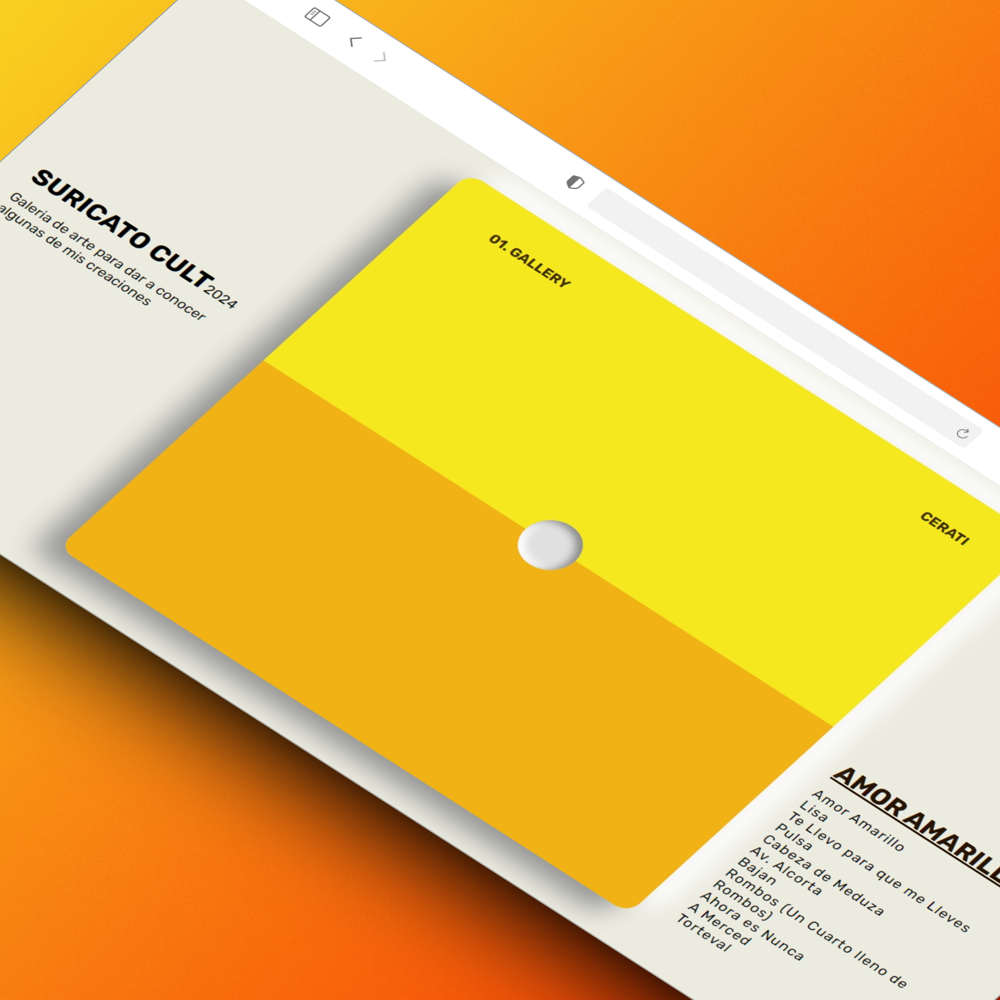
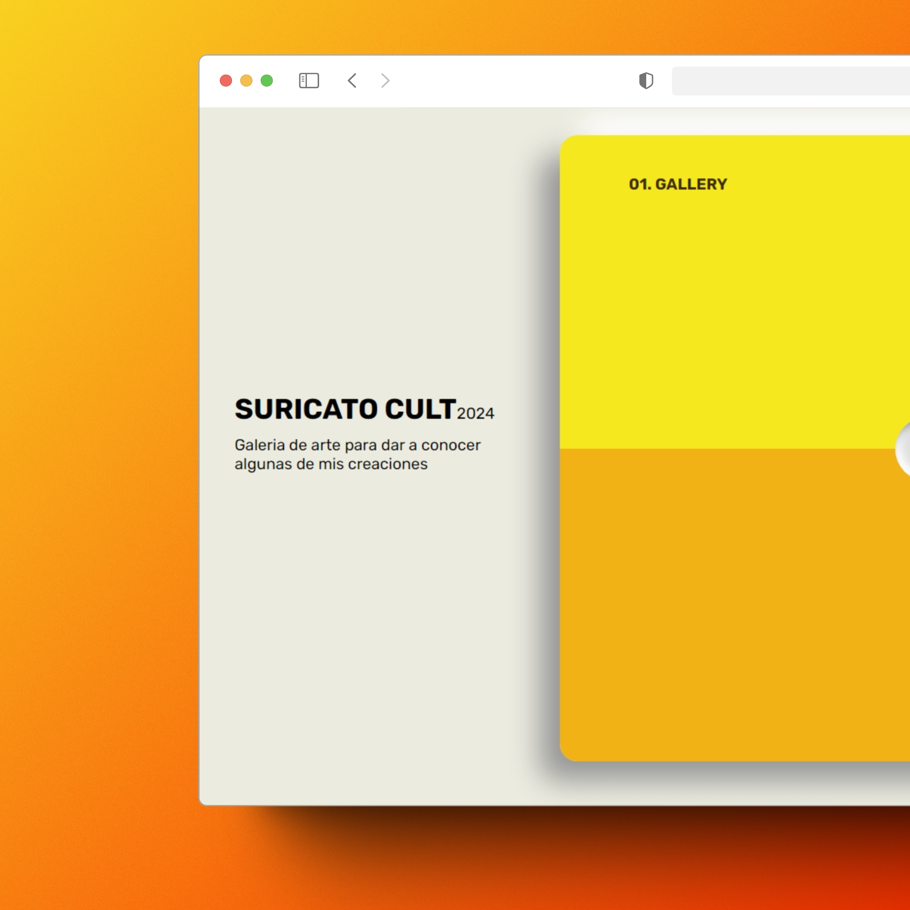
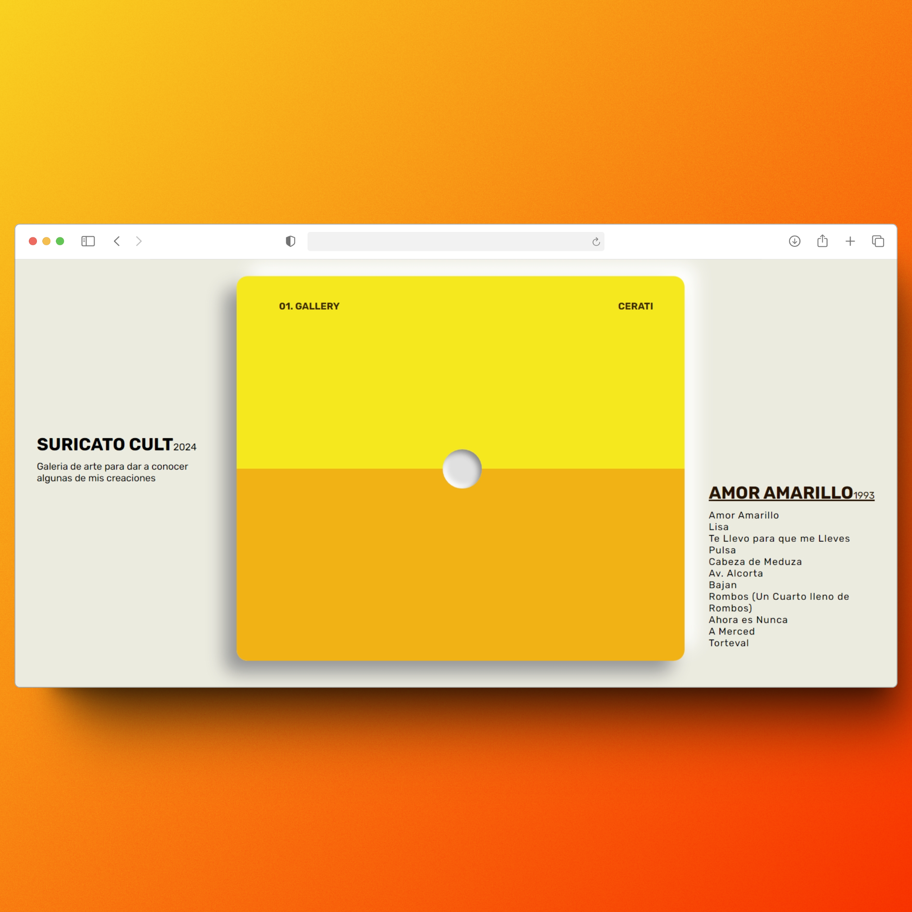

# Colección de Ilustracioes
> Portafolio web personal, estático y responsivo, que presenta una colección curada de arte e ilustración inspirada en el álbum musical "[Amor Amarillo](https://open.spotify.com/intl-es/album/75onhE4ne52iMHlVcpHUKR?si=d06969100e694d5e)".

> Enfocado en la estética minimalista y el rendimiento, utilizando tecnologías front-end esenciales.

## Ver en vivo
[🔗 Visita el Portafolio Aquí](https://suricato-cult-porfolio.vercel.app/)



## El Concepto: Arte y Música en Armonía

Este proyecto es una fusión de mis habilidades de desarrollo web con mi pasión por el arte y la música. La colección de ilustraciones exhibida está inspirada directamente en las letras, la instrumentación o la atmósfera general del álbum **"[Nombre del Álbum]"**.

El objetivo principal de este desarrollo fue:

1.  **Crear una Experiencia Inmersiva:** Presentar el arte en un formato de galería elegante y limpio.
2.  **Garantizar la Accesibilidad:** Asegurar que la colección sea hermosa y funcional en cualquier dispositivo (diseño responsivo).
3.  **Priorizar el Rendimiento:** Utilizar solo tecnologías fundamentales (HTML, CSS, JS) para una carga ultrarrápida.

## Características Principales

* **Responsivo y Adaptable:** Diseño que se ajusta perfectamente a cualquier tamaño de pantalla (escritorio, tablet y móvil) usando `Media Queries` y `Flexbox`/`Grid`.
* **Galería Curada:** Cada obra incluye su título, una breve descripción y el vínculo con la canción que la inspiró.
* **Estático y Rápido:** Construido con archivos simples de HTML, CSS y JavaScript, resultando en un sitio de alto rendimiento.
* **Interacciones Ligeras:** Uso de JavaScript puro (Vanilla JS) para efectos de galería o la navegación responsiva.
* **Sección de Contacto:** Información clara para conectar con [Tu Nombre] para consultas de arte o colaboraciones de desarrollo.

## Tecnologías Utilizadas

Este proyecto fue construido con las tecnologías fundamentales del desarrollo web front-end:

| Tecnología | Propósito |
| :--- | :--- |
| **HTML5** | Estructura semántica de todo el contenido del portafolio. |
| **CSS3** | Estilos visuales, layout responsivo y micro-animaciones estéticas. |
| **JavaScript** | Manejo del menú de hamburguesa y funcionalidad simple de la galería. |
| **GitHub Pages** | Alojamiento y despliegue del sitio estático. |

## Instalación y Ejecución Local

Si deseas clonar y explorar el código de este portafolio en tu máquina, sigue estos sencillos pasos:

1.  **Clona el repositorio:**
    ```bash
    git clone [https://www.youtube.com/watch?v=44ziZ12rJwU](https://www.youtube.com/watch?v=44ziZ12rJwU)
    ```

2.  **Navega al directorio del proyecto:**
    ```bash
    cd [nombre-del-repositorio]
    ```

3.  **Abre `index.html`:**
    Simplemente abre el archivo `index.html` en tu navegador web preferido (Chrome, Firefox, etc.). ¡El sitio se ejecutará instantáneamente, ya que es estático!


📧 **Contacto Directo:** [GIC.RC455@gmail.com]







